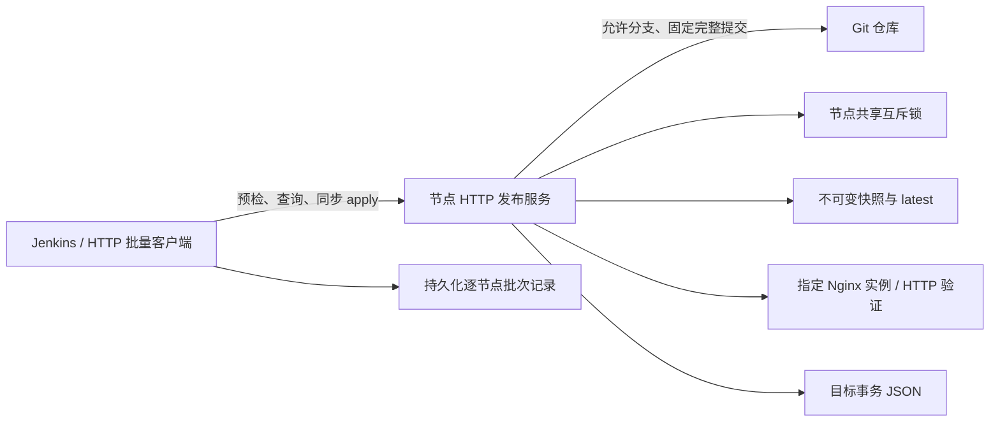

# Nginx HTTP 发布设计与实现（协议 2）

修订日期：2026-09-04。本文与本轮代码改造同步，沿用原文件名。部署架构为 HTTP 直连，没有发布中心、任务轮询、注册或结果回调。

代码已实现下述发布事务和客户端协议，自动化测试包含本地 Git、HTTP 资源、故障注入和并发检查。真实 Nginx 专用实例测试提供了入口，但当前环境未运行；第十六节区分已覆盖的自动测试和上线环境验收，不能把代码完成视为生产配置已验证。

## 一、目标与边界

Jenkins/命令行调用各节点的 HTTP 发布服务，显式提供环境、类型、站点、发布目录、分支及完整提交。节点从配置允许的 Git 仓库获取制品，处理本机文件、指定 Nginx 实例和本地状态。

单次请求同步执行并返回最终结果。收到运行中冲突时调用方查询原记录，不创建后台任务队列。节点不可达时结果视为未知，批次停止推进。

支持三种类型：

| 类型 | 制品 | 生效方式 |
| --- | --- | --- |
| config | Nginx 配置 | 原子切换、指定实例 nginx -t/reload、新 worker 与 HTTP 检查 |
| whitelist | Nginx 引用的白名单 | 同上，并配置实际放行/拒绝行为检查 |
| frontend_static | 构建完成的 index 与哈希资源 | 原子切换入口，验证新制品摘要与旧资源可达性 |

前端不执行构建，不自动修改 Nginx 路由。配置和白名单的 include 位置由运维预先配置，服务不会猜测主配置。

## 二、系统结构



旧 `internal/agent` 门面与调用已删除，实现已拆为 `internal/interfaces`、`internal/application`、`internal/domain` 和 `internal/infrastructure`，配置加载独立放在 `internal/config`。Jenkins 自身的 `agent any` 是构建执行器配置，与本系统部署通信方式无关。

## 三、身份与授权

- 环境以服务配置为准，请求不得跨环境。
- 目标由配置中的 `type + server_name + path_dest` 明确列举。
- path_dest 规范化为真实绝对根目录，部署目录为 `<root>/<type>/<site>`。
- `target_id = SHA256(JSON([env, deployment_dir]))`；同目录同环境得到相同身份，project 不参与身份。
- project 是可选约束/元数据。配置指定 project 时，省略会补为配置值，显式不一致拒绝。
- 节点有稳定 node_id。目标 `.publisher.json` 绑定 node_id、env、data_dir 和 lock_file，防止两套独立状态/锁接管同一目录。
- apply/state 使用 `X-Release-Token`。所有接口可配置来源 IP 白名单。
- XFF 仅在直连来源属于 trusted_proxy_cidrs 时采信，合并多条头后从右侧跳过可信代理，采用首个不可信地址。其左侧内容不作为身份依据。

Git URL 和凭据只来自服务配置。远端要求 HTTPS，无 URL 内嵌凭据，重定向关闭；Token 经子进程环境配置注入，不写仓库 URL、命令参数或持久化 git config。`file://` 仅供显式 allow_local 的测试/离线仓库。

## 四、配置契约

完整示例位于 `configs/service.example.yaml`。未知 YAML 字段、旧字符串 targets、缺失的必填项启动即报错。

必填：listen_addr、node_id、env、data_dir、lock_file、本环境 Token、targets、被使用类型的 repos 与非空 allowed_branches。

config/whitelist 还要求 Nginx binary/config_file/prefix/pid_file 正确对应同一个实例。binary、config_file、pid_file 必须为绝对路径。

每个目标至少有一条带内容断言的 health_checks，可设置 URL、Host、TLS server name、HTTP 状态及 contains。`{commit}` 可用于 URL/contains，运行时替换。首次无 latest 时使用单独的 initial_health_checks；无可验证基线不能假定恢复成功。

默认资源约束：

| 配置 | 默认值 |
| --- | --- |
| execution_timeout | 5 分钟 |
| step_timeout | 60 秒 |
| recovery_timeout | 90 秒，独立于原请求 |
| cleanup_timeout | 5 秒 |
| max_request_bytes | 64 KiB |
| max_concurrent_requests | 64 |
| max_archive_bytes / max_archive_files | 1 GiB / 100000 |
| min_free_bytes | 64 MiB |
| keep_releases | 5，最少 2 |
| asset_retention | 前端必须显式设置正值；示例为 7 天 |

目录不能重叠或覆盖数据目录；部署目录内不能放锁文件。服务拥有发布目录，Nginx worker 只需读取。文件默认 0644，目录 0755；状态、清单和归属文件限制读取。操作系统应保证本地文件系统的原子 rename 与 fsync 语义。

## 五、HTTP 协议

接口仍是 apply、state、healthz、metrics 四个路由。

### 5.1 能力预检

`GET /healthz` 返回：

```json
{"status":"ok","release_contract":2,"node_id":"nginx-uat-01","env":"uat","publish_ready":true,"busy":false,"reason":""}
```

客户端在任何写入前检查全部目标节点。协议字段缺失或非 2、节点身份重复、环境不符、待恢复时停止。ready 表示发布执行器可接收工作，不是完整业务健康证明；busy 可能随时变化，最终以发布锁为准。

### 5.2 发布请求

`POST /api/v1/releases/apply` 必须包含：

| 字段 | 约束 |
| --- | --- |
| release_id | 本次逻辑操作 UUID，重试不得更换 |
| expected_state_revision | 查询得到的目标修订号 UUID |
| env / type | 本节点环境及允许的三种类型 |
| branch | 允许分支；服务验证 Git ref 格式 |
| commit_id | 完整 40/64 位十六进制提交 ID |
| params.server_name | 安全的单段站点名，禁止路径穿越与保留名称 |
| params.path_dest | 与授权目标匹配的绝对根路径 |

可选 source_repo（须等于 type）、project、version、operator、build_url、app。version 仅用于展示，不进入目录名。批次恢复额外填写 restore_of，见第九节。

请求最多一个 JSON 对象，拒绝未知字段和超限输入。令牌在解析 JSON 前检查，未授权输入不创建发布记录或业务指标标签。

### 5.3 幂等和并发结果

同一 node 范围内 release_id 唯一，绑定规范化请求、target_id 和配置仓库 URL 的摘要。相同 ID 不同参数返回 `409 RELEASE_ID_CONFLICT`。同参数运行中返回 409，终态重放原记录并标记 replayed，待恢复返回 503。

一个节点所有目标共享进程内互斥及 flock。锁覆盖接受记录、Git 缓存、快照准备、切换、Nginx 操作、状态提交与清理。其他进程启动恢复也必须持锁，禁止在另一发布进行中推断它已崩溃。

预期 revision 在锁内再次检查。A→B→A 每次切换都会生成新 revision，旧 revision 不会因 commit 相同重新有效。

### 5.4 状态查询

首次查询：`GET /api/v1/releases/state?env=...&type=...&server_name=...&path_dest=...`，path_dest 进行 URL 编码。后续使用 env+target_id；两种定位方式不能混用。project 可选。

附加 release_id 可查原操作。响应中的 current、previous、state_revision、observed_link 是当前目标状态；release 是历史操作结果，不能把历史 succeeded 当成当前仍在运行该版本。只进行软链观测的 GET 不等价于再次完成 Nginx 生效检查。

### 5.5 发布响应

| 字段 | 含义 |
| --- | --- |
| status | running / succeeded / skipped / failed / recovery_required |
| phase | 最近执行阶段 |
| activation_status | unchanged / verified / restored / unknown |
| rollback_status | not_needed / succeeded / failed / unavailable |
| state_revision_before / after | 操作前后修订号 |
| error_code / error | 机器可识别错误与说明 |
| warnings | 不改变成功结果的清理告警 |
| steps | 有限阶段的结果和耗时 |

成功/跳过 200；无效输入 400/413；鉴权 401/403；竞争、幂等参数或修订号冲突 409；已接收操作执行失败 500；状态不确定或恢复失败 503。HTTP 连接超时只代表客户端没有拿到结论。

## 六、节点执行事务

1. 认证、输入与目标校验，生成请求指纹。
2. 检查重复 ID；取得节点锁后重新读取权威状态、检查重复 ID 和 expected revision。
3. 持久化 running 接受记录。
4. 比对真实 latest 与状态基线，验证基线快照及实际入口。相同提交也必须执行这些检查才能 skipped。
5. 正常发布 fetch 允许分支，确认目标对象确为 commit、解析为所给完整 ID，确认提交对该分支可达。按站点执行 git archive。
6. 受限解包，复制到随机 staging，验证必需文件、内容摘要、文件模式和可用磁盘，生成 .release-version 与清单。
7. 复用或创建不可变 releases 快照；前端安装不覆盖已有内容的共享哈希资源。
8. 再次确认 latest 未被外部修改，持久化候选、发布前链接、完整本地基线和 switch_intent。
9. 切换阶段使用独立于 HTTP 客户端的执行上下文，原子替换 latest。
10. config/whitelist 执行指定实例的 nginx -t、reload，并验证新 worker 和配置的 HTTP 行为；前端校验公开 HTTP 摘要与旧资源。
11. 一次原子状态写入同时提交 current、previous、新 revision、请求 succeeded 及最终结果。
12. 清理历史版本，清理失败记录 warnings。

第八步之前取消不会造成版本切换。进入关键阶段后，客户端断开不能取消生效或恢复；整体执行期限仍然有效。任何切换后失败都会进入独立期限的本地恢复。

子进程使用进程组，超时终止整组并收敛输出管道；输出截断并脱敏。Git archive 解包失败会关闭管道、终止生产进程并 Wait，避免旧版的管道阻塞。

## 七、文件安全与前端

### 7.1 快照

```text
<root>/<type>/<site>/
  .publisher.json
  .staging/stage-<随机 UUID>/
  releases/<完整 commit>/
  .manifests/<完整 commit>.json
  assets/
  latest -> releases/<完整 commit>
```

文件操作使用目录句柄约束（Go os.Root），解包和目录创建拒绝符号链接、硬链接、绝对路径、路径穿越、非普通文件和 `.git` 内容。临时目录和临时软链使用随机 ID，绝不使用 version。

清单保存提交、来源、文件 SHA-256 与大小。复用时校验完整文件集合和摘要，不能只凭目录存在判断成功。既有快照缺清单、内容漂移或无可信旧状态时明确失败/待恢复，禁止覆盖正在使用的目录。

### 7.2 前端资源

每个站点包含 index.html、带十六进制哈希文件名的 assets 和 frontend-manifest.json。清单声明所有制品的资源 SHA-256。除 index 外，所有文件均须是已声明的哈希资源；服务生成的版本探针除外。

服务静态检查 HTML/CSS/常见 JS 引用，拒绝发现的缺失资源；动态拼接地址无法靠正则完备分析，需要构建规范和浏览器验收补充。发布前不将“存在 index.html”当成完整资源校验。

assets 必须独立于 latest 映射，同名哈希路径已有不同内容时拒绝覆盖。发布后通过 public_base_url 校验新制品实际 HTTP 内容，并请求保留版本的旧资源，检测错误的 latest/assets 路由。

HTML/探针不缓存；资源可使用不可变缓存。asset_retention 至少覆盖客户端/懒加载兼容窗口，有限保留无法支持无限期不刷新的旧页面。

## 八、权威状态和启动恢复

每个目标一个 `data_dir/state/<target_id>.json`，schema=2，包括目标、current/previous、revision、active_release_id、恢复标记及 release_id→请求/结果/基线/意图记录。

写入临时文件后 fsync，rename 替换，再 fsync 父目录。成功结果与目标 current/revision 在同一文件中提交，避免拆成多个独立权威文件。查询结果不从日志推断。

当前实现保留全部 release_id 与结果，不会因快照清理遗忘幂等历史。记录会增长；尚未实现历史明细归档，运维需监测数据盘容量，不能直接删历史 ID 释放空间。

启动时持节点锁检查：

- 无切换意图的中断操作：发布失败、链接不变。
- 有意图且 latest 为候选：校验本地快照，重新测试/reload（如适用）并验证，确认后提交。
- latest 为原基线或候选不能确认：按本地基线恢复、验证，提交失败结果与新 revision。
- latest 不属于已记录候选/基线：保留现场，要求人工处理。
- 既有成功状态：比对当前链接、快照和 HTTP；不一致时阻止新发布。
- 已移除配置目标还有未完成状态：阻止其他目标继续发布。

状态持久化失败不能报普通成功。可报告 recovery_required，即使在线文件看起来已经生效；下次启动从最后耐久记录恢复。操作者修正外部漂移后重新启动，由同样的校验收敛。

## 九、恢复与回滚

单次发布自动恢复只使用本节点请求前保存的已验证快照，不 fetch Git，不依赖网络分支状态。重新切回原链接，测试/reload（如适用），验证旧行为。恢复成功仍表示本次发布失败，结果为 failed + restored + rollback succeeded，并生成新 revision。

首次发布原来没有 latest，恢复可删除新链接，但必须通过 initial_health_checks 确认原入口。无法确认时 recovery_required，禁止后续发布。

正常人工发布旧提交可发新的 apply。撤销指定批次操作则发新 release_id，restore_of 引用同目标、同环境的一次 succeeded：

- 请求 commit 必须等于原记录的本地基线提交。
- expected revision 必须同时等于当前 revision 与原成功操作的 after revision。
- 当前版本必须仍是原操作候选。
- 基线必须存在且完整；恢复直接使用本地快照。

原请求 skipped 不进入批次恢复。首次部署没有旧快照时批次自动恢复不可用，应在批次开始前采用 stop 策略。节点后来已被其他发布改变时返回冲突，禁止覆盖后续工作。

## 十、批量客户端与 Jenkins

节点 HTTP 服务全由 Go 实现，运行时不依赖 Python，也不会启动 Python 子进程。HTTP 协议与调用语言无关。

当前 `scripts/release_http.py` 是可选批量客户端，使用 Python 标准库；shell 文件是入口。保留 Python 的原因是该工具实现了逐节点批次落盘、未知结果查询和安全恢复，而不是服务端还存在 Agent。`scripts/frontend-manifest.py` 是构建后的制品清单工具，同样不在节点服务运行路径中。只需直接 HTTP 调用时，可以使用 curl、Jenkins 或其他语言；采用自建客户端仍需遵守以下持久化与恢复约束。

客户端配置 RELEASE_URLS、ENV、TYPE、BRANCH、COMMIT、PATH_DEST、SERVER_NAME、可选 PROJECT 及环境 Token。

新批次先预检全部节点、确认 node_id 不重复，再把每个节点 target_id、baseline、revision、原 UUID 和完整请求原子写到批次文件。持久化成功后才发送 HTTP。

逐节点执行，首个失败停止。默认 stop；可在开始前选择 restore，要求所有节点有旧基线。发生未知结果先按原 ID 查询，确认前不对任何节点启动回滚。重试使用原 ID/原参数。

update 只接受新批次文件，resume 从原记录继续，rollback 从同一记录逆序恢复各节点自己的基线。节点身份、当前 revision 和服务能力会再次校验。批次文件有独立进程锁，并原子更新；不保存 Token。

Jenkins 禁止同 Job 并发，归档批次文件。resume/rollback 通过 SOURCE_BUILD 读取原构建文件，示例依赖 Copy Artifact 插件。COMMIT_ID 必须显式填写制品仓库提交，不能默认使用 Jenkinsfile 所在仓库的 GIT_COMMIT。

## 十一、可观测性

### 11.1 日志契约

服务运行日志为每行一个 JSON 对象，默认 stdout；`log_file` 可指定绝对路径。统一顶层字段：`time`（UTC RFC3339Nano）、`level`（info/warn/error）、`message`、`event`。旧 `ts/msg/fields` 字段已替换，采集规则同步调整。

HTTP 访问日志 event=http_access：`request_id`、`node_id`、`env`、`client_ip`、`peer_ip`、`method`、`path`、`status_code`、`duration_ms`、`bytes_written`。发布请求补充 `release_id`、`target_id`、`release_status`、`error_code`。响应头返回服务生成的 `X-Request-ID`。

日志记录每个进入处理器的请求，包括认证失败、IP 拒绝、未知路由、限流与 panic；2xx/3xx 为 info、4xx 为 warn、5xx/panic 为 error。异常恢复在尚未写响应时返回 500。IP 与授权使用同一可信代理链解析；没有可信客户地址时为空，不使用伪造头。请求体、Token、查询字符串和完整头集合不写日志。

业务步骤与结果日志记录 release_id、target_id、有限阶段、业务 status、rollback_status 和耗时；失败使用 error。清理失败使用 warn。启动和 HTTP 服务器内部错误也通过 JSON 日志器输出。非 HTTP 事件没有访问 IP/HTTP 状态码时不补造数值。

### 11.2 指标契约

所有自定义指标前缀为 `nginx_updata_config_`：

| 指标后缀 | 类型及维度 | 含义 |
| --- | --- | --- |
| http_requests_total | Counter，handler/code | HTTP 响应数，路由固定枚举 |
| http_request_duration_seconds | Histogram，handler | HTTP 请求耗时 |
| release_terminal_total | Counter，env/release_type/target_id/status | 已接受事务的 succeeded/skipped/failed，重放不重计 |
| release_step_duration_seconds | Histogram，env/release_type/target_id/step/status | 已执行阶段耗时 |
| release_step_failures_total | Counter，env/release_type/target_id/step | 阶段失败次数 |
| rollback_total | Counter，env/release_type/target_id/status | 本地自动恢复尝试，succeeded/failed |
| cleanup_failures_total | Counter，env/release_type/target_id | 历史快照或导出目录清理失败 |
| state_persist_failures_total | Counter，env/release_type/target_id | 权威状态写入失败 |
| publish_ready | Gauge，env/node_id | 发布执行器是否可用 |
| target_recovery_required | Gauge，env/release_type/target_id | 目标是否待恢复 |
| release_in_progress | Gauge，env/release_type/target_id | 是否正在处理发布事务 |
| release_started_timestamp_seconds | Gauge，env/release_type/target_id | 当前事务开始时间，空闲为 0 |
| last_success_timestamp_seconds | Gauge，env/release_type/target_id | 当前持久版本验证时间，无版本为 0 |

commit、release_id、访问 IP 和任意请求 project 不作 Prometheus 标签。未授权/无效请求只影响有限的 HTTP 计数。目标和阶段计数器在启动时建立零值，阶段来自固定枚举。恢复标记及当前版本验证时间在 health/metrics 请求时从状态视图刷新，重启后仍可观测；Counter 统计本进程事件，应使用 rate/increase 处理重启。

### 11.3 告警接入

`configs/prometheus-alerts.example.yml` 提供 9 条规则：发布失败、抓取不可达、发布不可用、步骤失败、自动恢复失败、状态写失败、清理失败、执行超时及集中 401/403。步骤标签可区分 fetch、nginx_test、reload 和实际生效检查。执行超时默认 10 分钟并持续 1 分钟，应匹配部署的执行/恢复时间预算。

`configs/prometheus-scrape.example.yml` 已包含 rule_files 和 Alertmanager 连接示例；记录规则和告警文件应随配置安装。实际通知由现有 Alertmanager 接收方配置负责，本仓库不预设邮箱或 webhook。接入前用 `promtool check config`、`promtool check rules` 验证并做故障演练；本地没有 promtool 时不能把 Go 测试视为告警表达式执行验证。规则说明见 [Prometheus 官方文档](https://prometheus.io/docs/prometheus/latest/configuration/alerting_rules/)。

## 十二、部署和迁移

构建要求 Go 1.25+，运行建议 Linux；Git 必须可用。节点启动不会主动安装 Nginx。

新配置不兼容旧宽泛 targets 和任意目录前缀策略；不能给旧服务发送新 JSON 字段后假设协议有效。

已有文件无新状态时禁止直接发布。config/whitelist 提供 `-adopt-target/-adopt-branch/-adopt-commit` 离线导入：仅接受旧 latest 指向本目标完整提交子目录，逐文件与允许 Git 来源比对，建立快照、耐久意图后执行切换和验证。旧目录保留，中断后启动恢复。导入期间旧发布进程必须停止。

当前不自动转换旧前端目录。应在新目标适配共享 assets 路由，验证后按站点流程切换入口。旧状态文件不直接转换成新事务成功记录。

systemd 关停期限覆盖执行与恢复期限，主进程实际等待 Shutdown 和发布结束。部署示例路径应按本机安装位置调整。

## 十三、清理与异常处理

快照保留集合至少包括：current、previous、实际 latest、所有未完成请求的基线/候选、最近 keep_releases 个快照。前端还包括兼容窗口内曾使用或短暂激活的候选与基线，资源按存活清单并集保留。

清理在节点锁内执行，每个目录项检查取消；文件系统调用本身仍受操作系统 I/O 行为约束。先确认发布成功再清理，不清理 active snapshot，不改写已有内容。临时导出清理失败记录告警。

| 异常 | 处理 |
| --- | --- |
| 拉取/解包/制品校验失败 | failed，latest 不变 |
| 基线链接或内容漂移 | 阻止切换，待恢复 |
| nginx -t/reload/新 worker/HTTP 检查失败 | 恢复本地基线后报告失败 |
| 恢复失败或状态写入不确定 | recovery_required，阻止新发布 |
| 清理失败 | 已成功结果保留，warnings/日志告警 |
| 同 ID 参数变化或 revision 变化 | 409，不覆盖旧操作 |
| 批次节点超时或失联 | 结果未知，保存记录并停止推进 |

## 十四、已替换的旧行为

| 旧行为/缺陷 | 当前实现 |
| --- | --- |
| Agent 命名和门面 | HTTP 接口、应用编排、领域模型、基础设施明确分层 |
| 用 version 创建/删除工作目录 | 随机临时目录；version 仅展示 |
| latest 切换失败后不恢复 | 耐久意图、独立恢复期限和本地基线 |
| 只按 commit 跳过 | 基线链接/摘要/HTTP 验证后才 skipped |
| 无互斥与固定 latest.tmp | 节点 flock + 进程锁，随机原子软链 |
| project/site 状态键冲突 | env+真实部署目录 target_id |
| 状态直接截断写 | 临时文件 + fsync + rename + 目录 fsync |
| Git PAX 头失败和管道等待 | 接受标准元数据，错误时关闭/终止/回收生产者 |
| 从首节点 previous 统一回滚 | 每节点原成功记录与 revision 保护 |
| XFF 首段可信 | 从可信代理链右侧解析 |
| 任意请求值进入监控标签 | 配置目标与有限阶段标签 |

## 十五、代码职责

| 位置 | 职责 |
| --- | --- |
| cmd/nginx_updata_config | 配置检查、迁移入口、依赖组装、HTTP 启动和关停 |
| internal/interfaces/httpapi | 严格 JSON、认证、来源限制、HTTP 路由、访问日志 |
| internal/application/publisher | 发布事务、幂等、版本及资源策略、启动恢复与迁移 |
| internal/domain/release | 请求/响应协议、身份与参数验证 |
| internal/domain/target | 授权目标和健康检查模型 |
| internal/domain/state | 快照清单、版本、发布记录与目标事务状态 |
| internal/infrastructure/nginx | 指定实例测试/reload、worker 与 HTTP 生效验证 |
| internal/infrastructure/state | 事务模型的单文件 JSON 持久化 |
| internal/infrastructure/fsutil | 目录句柄、原子写与受限清理 |
| internal/infrastructure/git | 允许来源、提交校验、受限归档 |
| internal/infrastructure/lock / process | 共享锁、子进程期限与进程组 |
| internal/infrastructure/prom / applog | 有限指标与 JSON 日志 |
| internal/config | 严格 YAML、参数与目标映射校验 |
| scripts / Jenkinsfile | 可选客户端：持久化逐节点 HTTP 批次、前端清单工具 |

依赖规则：HTTP 适配器通过 `Publisher` 接口调用用例；应用层处理发布流程并调用基础设施，Nginx 运行环境通过 `Runtime` 接口替换。基础设施负责外部系统操作。领域模型不依赖接口层、应用层、基础设施或配置加载器。配置加载器复用领域目标类型，存储层复用领域事务类型，避免领域对象反向依赖 YAML 或 JSON 文件存储实现。

## 十六、验收

已提供自动化测试（本地 Git、HTTP 测试服务、Runtime 故障注入）：

| 场景 | 预期 |
| --- | --- |
| version 为 .. | 不删除数据目录 |
| 归档穿越/绝对路径/符号链接/硬链接 | 拒绝，部署根外不写入 |
| 预置 staging 符号链接 | 拒绝 |
| 真实 Git PAX 导出/大管道错误 | 正常导出；拒绝时及时收敛子进程 |
| 禁止分支/完整提交校验 | 拒绝非允许来源和错误对象 |
| 归档/空间/HTTP 输入限制 | 失败前不切换 |
| 同 ID 重试、重启重放、参数冲突 | 返回原结果或 409 |
| 同进程与独立 flock 竞争 | 单一节点写者 |
| 不同 data_dir/lock 接管同目录 | 归属校验拒绝 |
| A→B→A 后陈旧 revision | 409 |
| 客户端取消准备/关键阶段断开 | 准备失败不切换；关键事务继续 |
| Nginx 测试失败、reload 无实际生效 | 恢复基线，报告 failed |
| 恢复失败/成功提交落盘失败 | recovery_required，重启收敛 |
| 当前文件或 latest 漂移 | 不误报 skipped |
| 无意图中断/有意图启动恢复 | 根据耐久记录收敛 |
| 首次部署失败 | 恢复链接缺失并验证原入口 |
| restore_of 本地恢复/后续版本冲突 | 不调用 Git；不覆盖后续版本 |
| 清理失败/current/previous 保护 | 成功保留、告警、保护快照 |
| 新前端旧资源/错误 assets 路由 | 旧资源可达；错误映射触发恢复 |
| 前端缺引用或哈希路径冲突 | 切换前拒绝 |
| XFF 伪造、未认证标签输入 | 不绕过来源授权，不增加任意业务标签 |
| JSON 访问日志、401/403/404/500、panic | IP/状态码/耗时正确，令牌/查询参数/异常值不泄漏 |
| 发布失败、幂等重放、自动恢复失败指标 | 失败计数增一，重放不重计，目标待恢复 Gauge 为 1 |
| 老服务预检/响应丢失/批次磁盘失败 | 写入前停止、按原 ID 查、持久化失败不 POST |
| 节点旧版本不同/恢复期间版本改变 | 各自恢复或停止 |

还需在目标环境执行的验收：

1. `NGINX_TEST_BINARY=/实际/nginx go test ./internal/application/publisher -run TestRealNginxActivationAndRecovery -v`：专用实例的 reload、新 worker、语法失败恢复、HTTP 不符合预期的恢复。
2. 真实站点 include/白名单规则、Host/SNI、文件访问权限与 PID 配置一致性。
3. 真实前端浏览器旧页面懒加载、CDN/缓存期限、动态资源路径与跨版本路由。
4. Jenkins 凭据、持久归档和 Copy Artifact 权限；中断后使用原批次文件恢复。
5. 部署文件系统上的异常断电/fsync 行为，以及长期磁盘容量和记录归档方案。

当前没有实际 Nginx 二进制，下载未获批准，第 1 项未运行。不能把 Runtime 注入测试等同于该实例验收。测试应使用隔离目录和专用实例。

## 十七、上线检查顺序

先验证新配置、可信基线和 HTTP 入口，再对专用实例完成第十六节验收。升级节点服务与批量客户端，保留旧快照和原批次记录。上线逐节点检查 release_contract、node_id、目标映射和 publish_ready，首个节点确认后再推进。出现 recovery_required 时先查原 release_id 与实际链接，修复并启动恢复，不以新 ID 强行覆盖。
